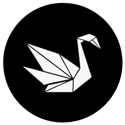

# Origami — simple image cropping lib for KMP

[](https://kotlinlang.org)
[](https://central.sonatype.com/artifact/tech.ryadom/origami)


With this tool you can crop images in Compose Multiplatform.

## Supported targets

| Target          | Implemented | Tested |
|-----------------|-------------|--------|
| **Android**     | ☑           | ☑      |
| **iOS**         | ☑           | ☑      |
| **JVM Desktop** | ☑           | ☑      |
| **JS**          | ☑           | ☑      |
| **WasmJS**      | ☑           | ☑      |

### Implementation

In your shared module's build.gradle.kts add:

```Gradle Kotlin DSL
kotlin.sourceSets.commonMain.dependencies {
  implementation("tech.ryadom:origami:1.0.0")
}
```

### Usage

To create an `Origami` instance, you need to call any of `Origami` constructors and pass
source (now supports `ImageBitmap`) and options as arguments.
Then use the `Origami` object as shown below.

```Kotlin
val source = createYourSource()
val colors = object: OrigamiColors { } // Customize colors
val cropArea = OrigamiCropArea() // Customize crop area
val aspectRatio = OrigamiAspectRatio() // Customize aspect ratio

val origami = Origami(source, colors, cropArea, aspectRatio)

OrigamiImage(origami = origami)

// Returns cropped image
origami.crop()
```

### Customization

#### 1. Colors

With `OrigamiColors` you can customize `backgroundColor`, `guidelinesColor` and `edgesColor`:

```Kotlin
interface OrigamiColors {
    val backgroundColor: Color

    val guidelinesColor: Color

    val edgesColor: Color
}
```

#### 2. Crop area

With `OrigamiCropArea` you can customize the crop area:

2.1. Number and width of guidelines

2.2. Shape edges via `OrigamiEdges`. You can use the default `Circle` or `Rectangle` shape, or
create your own using `DrawScope`

2.3. The highlighted area of ​​the shape via `OrigamiHighlightedShape`. You can use `Circle`,
`Rectangle` (default) or `RoundedRectangle` by default or create your own shape

2.4. Crop area initial paddings via `OrigamiCropAreaPadding`

```Kotlin
data class OrigamiCropArea(
    val highlightedShape: OrigamiHighlightedShape = OrigamiHighlightedShape.Default,
    val edges: OrigamiEdges? = OrigamiEdges.Circle(6.dp),
    val guidelinesWidth: Dp = 2.dp,
    val guidelinesCount: Int = 2,
    val initialPaddings: OrigamiCropAreaPadding = OrigamiCropAreaPadding.createDefault()
)
```

#### 3. Aspect ratio

With `OrigamiAspectRatio` you can specify any width / height ratio of crop area you need.

```Kotlin
data class OrigamiAspectRatio(
    val isVariable: Boolean = false,
    val aspectRatio: Float = 1f
)
```

### License

```
   Copyright 2025 Ryadom Tech

   Licensed under the Apache License, Version 2.0 (the "License");
   you may not use this file except in compliance with the License.
   You may obtain a copy of the License at

       http://www.apache.org/licenses/LICENSE-2.0

   Unless required by applicable law or agreed to in writing, software
   distributed under the License is distributed on an "AS IS" BASIS,
   WITHOUT WARRANTIES OR CONDITIONS OF ANY KIND, either express or implied.
   See the License for the specific language governing permissions and
   limitations under the License.
```

### Support

If you find a bug or want to contribute an improvement, please create an Issue or send an email to
opensource@ryadom.tech.
Any support will be appreciated.
